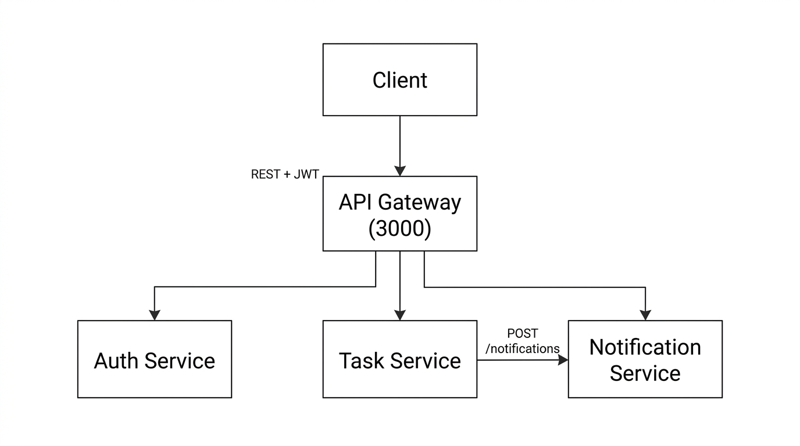

# HW#2 – Microservice Integration & Distributed Communication

## Project Overview

This project extends a single microservice architecture into a **distributed microservice-based system**.

The system demonstrates key distributed software architecture concepts including:

- Microservice architecture
- API Gateway pattern
- Service-to-service communication
- JWT authentication
- Protected routes
- Distributed service design

The system is composed of four independent services:

- **API Gateway**
- **Auth Service**
- **Task Service**
- **Notification Service**

Each service runs independently and communicates using REST APIs.

## Homework coverage (HW#1–HW#5)

| Assignment | What this repository demonstrates |
|--------------|-----------------------------------|
| **HW#1** | Four **microservices**, each with its own Express app, port, and **core functionality**; task-service uses a small **layered structure** (domain, API, infrastructure). |
| **HW#2** | **API Gateway** pattern, **REST** service-to-service calls, **JWT** authentication, **protected** task routes, notification triggered when a task is created. |
| **HW#3** | **Docker Compose** deployment, **Dockerfiles**, **GitHub Actions** CI/CD (`npm ci`, `npm test`, `docker compose build`), **environment** configuration via `.env.example` files. |
| **HW#4** | **Structured logging** (pino + `service` field), **`/metrics`** (Prometheus format), **Prometheus** and **Grafana**, Docker **healthchecks**, **axios-retry** on outbound HTTP. |
| **HW#5** | **bcrypt** password hashing, **JWT_SECRET** from the environment, **rate limiting** on the gateway, **AI summarization** endpoint (OpenAI when configured, otherwise mock), secrets via env / Compose. |

---

## HW#3 – Deployment (Docker Compose & CI/CD)

### Configuration

Each service reads environment variables (see `.env.example` in that service’s folder). Shared values for local development:

| Variable | Purpose |
|----------|---------|
| `PORT` | HTTP port for that service |
| `JWT_SECRET` | Must match between **auth-service** and **task-service** for valid tokens |
| `AUTH_SERVICE_URL` | Base URL of the auth service (used by **api-gateway**) |
| `TASK_SERVICE_URL` | Base URL of the task service (used by **api-gateway**) |
| `NOTIFICATION_SERVICE_URL` | Base URL of the notification service (**api-gateway** and **task-service**) |
| `OPENAI_API_KEY` | Optional; **api-gateway** `POST /ai/summarize` uses OpenAI when set, otherwise a mock summary |
| `LOG_LEVEL` | Optional **pino** log level (default `info`) |
| `GRAFANA_ADMIN_PASSWORD` | Optional Grafana admin password (Compose default `admin`) |

Copy each service’s `.env.example` to `.env` when running locally. For **auth-service** and **task-service**, `JWT_SECRET` is **required** (no in-code default).

Optional: add a **repository root** `.env` (see root `.env.example`) with `JWT_SECRET`, `OPENAI_API_KEY`, or `GRAFANA_ADMIN_PASSWORD` for Docker Compose substitution.

### Run the full stack with Docker Compose

From the repository root (Docker Desktop or Docker Engine required):

```bash
docker compose up --build
```

Or use the helper script (Unix shell / Git Bash):

```bash
chmod +x deploy.sh
./deploy.sh
```

**Host ports:** **3000** (API Gateway), **9090** (Prometheus), **3005** (Grafana). Other services are reachable only inside the Compose network (for example `http://auth-service:3001`). Docker Desktop (or another Docker engine) must be running for `docker compose` commands to work.

Example after the stack is up:

```http
GET http://localhost:3000/health
POST http://localhost:3000/auth/login
POST http://localhost:3000/ai/summarize
```

### Run automated tests

Tests use Node’s built-in test runner (`node --test`) and **supertest** (no running Docker required for unit/smoke tests).

From each service directory:

```bash
cd api-gateway && npm install && npm test
cd ../auth-service && npm install && npm test
cd ../task-service && npm install && npm test
cd ../notification-service && npm install && npm test
```

Each service includes at least a **GET /health** test; **auth-service** also includes a small **login** integration-style test.

### CI/CD (GitHub Actions)

Workflow file: `.github/workflows/ci-cd.yml`.

On every push or pull request to `main` / `master` it:

1. Checks out the code
2. Sets up Node.js 20
3. Runs `npm ci` and `npm test` in **api-gateway**, **auth-service**, **task-service**, and **notification-service** (in that order)
4. After tests pass, runs **`docker compose build`** to verify all images build

You need a GitHub repository with Actions enabled for this to run on push.

---

## HW#4 – Observability & reliability

- **Structured logging:** Every service logs with **pino** JSON lines that include a `service` field (visible with `docker compose logs`).
- **Metrics:** Each service exposes **`GET /metrics`** (**prom-client**) with `http_requests_total` and `http_request_duration_seconds` (plus default Node metrics).
- **Monitoring stack:** **Prometheus** (`monitoring/prometheus.yml`) scrapes all four app services; **Grafana** is provisioned with a default Prometheus datasource.
- **Health:** Compose **healthchecks** call each service’s existing **`GET /health`** (images include `wget`).
- **Retries:** Outbound **axios** calls from **api-gateway** and from **task-service** → notification use **axios-retry** (2 retries, exponential backoff; includes retry on 5xx responses).

**Quick checks**

- Prometheus UI: [http://localhost:9090](http://localhost:9090) → Status → Targets (all four jobs should be **UP** after a short wait).
- Grafana: [http://localhost:3005](http://localhost:3005) — login **`admin` / `admin`** (or the password from `GRAFANA_ADMIN_PASSWORD`). A dashboard **Microservices Observability Dashboard** is **auto-provisioned**; open [http://localhost:3005/d/ms-observability/microservices-observability-dashboard](http://localhost:3005/d/ms-observability/microservices-observability-dashboard) (or **Dashboards** in the left menu).
- Logs: `docker compose logs -f api-gateway` (JSON lines include `"service":"api-gateway"`).

---

## HW#5 – Security & AI

- **Passwords:** **auth-service** stores **bcrypt** hashes only; demo logins remain `admin` / `admin123` and `user` / `user123`.
- **JWT secret:** **auth-service** and **task-service** require **`JWT_SECRET`** from the environment (Compose still supplies a default via `${JWT_SECRET:-homework_secret}` for local runs).
- **Rate limiting:** **api-gateway** uses **express-rate-limit**: stricter limit on **`POST /auth/login`**, general limit on other routes (`/health`, `/metrics`, and `/auth/login` are excluded from the general limiter).
- **AI summarization:** **`POST /ai/summarize`** on the gateway accepts JSON `{ "text": "..." }`. If **`OPENAI_API_KEY`** is set, the gateway calls the OpenAI Chat Completions API (`gpt-4o-mini`); otherwise it returns a **mock** summary.

---

## System Architecture



# Architecture Explanation

### Client

The client (Postman or any frontend application) sends all requests to the **API Gateway**.

The client never communicates directly with internal services.

---

### API Gateway

The **API Gateway** acts as the single entry point for the system.

Responsibilities:

- Receives all client requests
- Routes requests to the appropriate microservice
- Simplifies communication between client and services

Gateway routes:


/auth
/tasks
/notifications
/health
/metrics
/ai/summarize


Port:


3000


---

### Auth Service

Auth Service is responsible for **authentication and token generation**.

Responsibilities:

- User login
- JWT token generation
- Authentication handling

Example users:


admin / admin123
user / user123


Port:


3001


Endpoint:


POST /auth/login
GET /health


---

### Task Service

Task Service is responsible for **task management**.

Responsibilities:

- Create task
- List tasks
- Get task by ID
- Update task
- Delete task

Protected operations require **JWT authentication**.

Port:


8080


Endpoints:


GET /tasks
GET /tasks/:id
POST /tasks
PATCH /tasks/:id
DELETE /tasks/:id
GET /health


---

### Notification Service

Notification Service stores notifications generated when tasks are created.

Responsibilities:

- Store notifications
- List notifications
- Health check

Port:


3003


Endpoints:


GET /notifications
POST /notifications
GET /health


---

# Service Communication

The services communicate using **REST-based service-to-service communication**.

### Communication Flow

1. The client sends login request to **API Gateway**


POST /auth/login


2. API Gateway forwards the request to **Auth Service**

3. Auth Service verifies credentials and returns a **JWT token**

4. The client sends task requests with the JWT token


Authorization: Bearer <token>


5. API Gateway forwards the request to **Task Service**

6. When a new task is created, Task Service sends a request to **Notification Service**


POST /notifications


7. Notification Service stores the notification and returns a response.

---

# Authentication and Authorization

Authentication is implemented using **JWT (JSON Web Token)**.

### Authentication Flow

1. User logs in via:


POST /auth/login


2. Auth Service generates a **JWT token**

3. The client includes the token in future requests:


Authorization: Bearer <token>


4. Task Service validates the token before executing protected operations.

---

### Protected Endpoints

The following operations require authentication:


POST /tasks
PATCH /tasks/:id
DELETE /tasks/:id


If no token is provided, the server returns:


401 Unauthorized


---

# API Endpoints

## API Gateway


GET /health
GET /metrics
POST /auth/login
POST /ai/summarize
GET /tasks
GET /tasks/:id
POST /tasks
PATCH /tasks/:id
DELETE /tasks/:id
GET /notifications


---

## Auth Service


GET /health
GET /metrics
POST /auth/login


---

## Task Service


GET /health
GET /metrics
GET /tasks
GET /tasks/:id
POST /tasks
PATCH /tasks/:id
DELETE /tasks/:id


---

## Notification Service


GET /health
GET /metrics
POST /notifications
GET /notifications


---

# Technologies Used

The project is built using the following technologies:


Node.js
Express.js
JWT Authentication
Axios
REST APIs
Microservice Architecture
API Gateway Pattern


---

# How to Run the Project

Each service must be started in a separate terminal.

---

## Start Auth Service


cd auth-service
npm install
npm start


Runs on:


http://localhost:3001


---

## Start Task Service


cd task-service
npm install
npm start


Runs on:


http://localhost:8080


---

## Start Notification Service


cd notification-service
npm install
npm start


Runs on:


http://localhost:3003


---

## Start API Gateway


cd api-gateway
npm install
npm start


Runs on:


http://localhost:3000


---

# Example Test Flow

### 1 Login


POST http://localhost:3000/auth/login


Body:


{
"username": "admin",
"password": "admin123"
}


Returns:


JWT Token


---

### 2 Create Task


POST http://localhost:3000/tasks


Headers:


Authorization: Bearer <token>


Body:


{
"title": "Finish HW2",
"description": "Create distributed system",
"status": "todo"
}


---

### 3 Check Notifications


GET http://localhost:3000/notifications


A notification appears when a task is created.

---

### 4 Unauthorized Test

If the token is missing:


POST /tasks


The response will be:


401 Unauthorized


---

# Project Structure


hw2-microservices
│
├── .github/workflows/ci-cd.yml
├── docs/architecture-diagram.png
├── monitoring/prometheus.yml
├── monitoring/grafana/provisioning/…
├── monitoring/grafana/dashboards/microservices-dashboard.json
├── docker-compose.yml
├── deploy.sh
├── .env.example
│
├── api-gateway
│ ├── server.js
│ ├── logger.js
│ ├── metrics.js
│ └── package.json
│
├── auth-service
│ ├── server.js
│ ├── logger.js
│ ├── metrics.js
│ └── package.json
│
├── task-service
│ ├── src
│ ├── index.js
│ └── package.json
│
├── notification-service
│ ├── server.js
│ ├── logger.js
│ ├── metrics.js
│ └── package.json
│
└── README.md


---

# Conclusion

This project successfully demonstrates a distributed microservice architecture.

Key concepts implemented in the system include:

- API Gateway pattern
- REST-based service communication
- JWT authentication
- Microservice separation
- Protected endpoints
- Event-like service interaction between services

The system shows how independent services can collaborate to build a scalable distributed application.